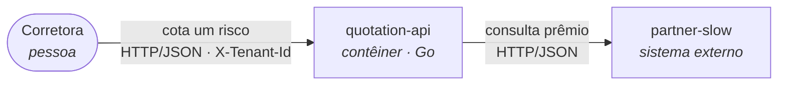

# Desafio: Fundamentos de Arquitetura de Solução

Uma plataforma de cotação de seguro auto que funciona mal: consulta três seguradoras parceiras em série, aguarda sem timeout configurado e devolve erro inteiro quando qualquer uma falha. Tudo o que é preciso para reproduzir essa degradação já está neste repositório; nada do que a resolve está.

A entrega são duas peças que valem por uma só: um SAD (Solution Architecture Document) que decide e justifica, e um PoC que implementa a fatia decidida e prova, com evidência medida por você, que ela funciona. O documento vem primeiro; o código é subordinado a ele.

## O que você vai entregar

**Entrega 1, o SAD, em `docs/sad.md`.** O documento de arquitetura da plataforma *depois* da sua
intervenção: oito seções, quatro diagramas C4 em Mermaid, e todo número defendido. É ele que fixa o
TTL do cache, os limiares e o escopo do circuit breaker, antes de você escrever a primeira linha de
código. O que se pede está em [Entrega 1: o SAD](#entrega-1-o-sad).

**Entrega 2, o PoC, em código.** A fatia que o seu próprio SAD defendeu, construída sobre este
repositório e provada em execução: **circuit breaker**, **cache** e **fallback** na fronteira com as
parceiras, mais a instrumentação que prova que os três funcionam e as evidências que você mediu. O
que se pede está em [Entrega 2: o PoC](#entrega-2-o-poc).

### Onde cada coisa vai

```
docs/sad.md                         # ENTREGA 1: o SAD, as oito secoes         <- voce cria
docs/evidencias/                    # as evidencias que voce mediu             <- voce cria
internal/partner/client.go          # a fronteira sem protecao: o BREAKER nasce aqui  <- voce estende
internal/quotation/service.go       # serie e tudo-ou-nada: CACHE e FALLBACK aqui     <- voce estende
internal/<pacote novo>/             # o que a sua arquitetura pedir            <- voce cria
cmd/quotation-api/main.go           # boot: ligar o que voce construir         <- voce estende
internal/platform/config.go         # novos parametros (TTL, limiares)         <- voce estende
docker-compose.yml                  # com moderacao                            <- voce estende
cmd/partner-mock/                   # as tres parceiras: restricao do cenario  <- NAO ALTERE
cmd/loadgen/                        # o gerador de carga                       <- nao altere
docs/guia-sad.md                    # o que cada secao do SAD precisa ter      <- leitura
docs/roteiro-cenario-de-falha.md    # como observar o "antes" no Jaeger        <- leitura
docs/smoke-test-factibilidade.md    # o que ja esta medido sobre as parceiras  <- leitura
```

Arquivos extras legítimos são bem-vindos e ficam nas pastas que já existem: pacote novo em
`internal/`, teste novo junto do código que ele testa, documento de apoio em `docs/`.

## O problema, em seis linhas

A **Prumo Tecnologia em Seguros** é uma empresa fictícia que vende software para quem vende seguro: o
corretor informa motorista e veículo, a plataforma consulta três seguradoras e devolve as propostas da
mais barata para a mais cara. Três fatos decidem tudo o que você vai projetar:

- as **três parceiras são instáveis por natureza** (uma lenta, uma que falha 40% das vezes, uma que
  afunda sob concorrência), e a disponibilidade da plataforma é hoje o *produto* da disponibilidade
  das três;
- **cada consulta a uma parceira custa R$ 0,04**, e são 360.000 por dia útil, o que faz do cache uma
  decisão financeira antes de ser uma otimização;
- **cada requisição declara a corretora no cabeçalho `X-Tenant-Id`** e carrega CPF e placa sob contrato
  de operadora na LGPD, o que faz do isolamento entre corretoras uma obrigação legal antes de ser um
  cuidado de engenharia.

A conta inteira, o teto comercial de 24 horas de uma cotação e o que SUSEP e LGPD impõem estão em
[O cenário](#o-cenário-negócio-custo-e-regulação). Você vai precisar deles para as seções 4, 7 e 8 do
SAD, e é de lá que saem os números da sua planilha.

O que se avalia é a decisão defendida com número, não a quantidade de padrões que você conhece.

## As regras não negociáveis

**Tecnologias obrigatórias:**

- **Go 1.25** para a API e para os testes. A linguagem não muda.
- **Docker com Compose v2** para o ambiente. O `docker-compose.yml` daqui é o ponto de partida.
- **Redis** como cache. Ele já sobe no compose e a API ainda não fala com ele.
- **OpenTelemetry** para a instrumentação, com o SDK que já está inicializado em
  `internal/platform/telemetry.go`. Traces vão para o Jaeger e métricas para o Prometheus, ambos via
  Collector.
- **Mermaid** para todo diagrama, dentro do próprio Markdown. Imagem colada de diagrama não vale.
- A biblioteca de circuit breaker é **decisão sua**, e a escolha se defende no SAD.

**Restrições:**

- **Não altere `cmd/partner-mock/`.** As três parceiras são a restrição do cenário, não parte da
  solução.
- **Não altere os perfis das parceiras no compose** (`PARTNER_SEED`, `PARTNER_FAILURE_RATE`, latências,
  parâmetros de degradação) na configuração que sustenta a sua evidência.
- **Não quebre o que já passa.** Os testes que já vêm no repositório continuam verdes.
- **Não reescreva a base.** A entrega é a extensão dela, não um projeto novo com o mesmo nome.
- **A chave de cache contém a corretora.** Sem exceção.
- **Prêmio é sempre de parceira ou de cache rastreável.** Nada de valor calculado pela plataforma.
- Encontrou uma limitação real que te impeça de cumprir um requisito? Documente no README do processo
  em vez de reescrever o mecanismo. Limitação documentada é decisão de arquitetura; limitação
  contornada em silêncio é entrega que não se consegue avaliar.

**Fora de escopo:**

- Retry com backoff, bulkhead, rate limiting, fila, autenticação e Kubernetes. Cite no SAD o que fizer
  sentido citar, mas **não implemente**. Se você está escrevendo o quarto pattern, saiu do escopo do
  desafio.
- Persistência de auditoria de verdade. A auditoria é decisão de arquitetura no SAD e custo na seção 8,
  não uma tabela para você criar.
- Garantia transacional entre cache e parceira, e qualquer discussão de concorrência além da que a
  paralelização da agregação exigir. Duas requisições concorrentes da mesma corretora para a mesma
  placa, uma servida de cache e a outra da parceira, devolvem dois prêmios diferentes para o mesmo
  risco no mesmo minuto: é um bom assunto de SAD, e vale citar, mas não é código desta entrega.
- Integração real com qualquer seguradora. As três parceiras são e continuam mocks.
- Corrigir bugs pré-existentes que não sejam os quatro buracos declarados.
- Interface de usuário, cadastro de corretoras, cobrança, relatório para o corretor.
- Reescrever a telemetria genérica que já vem pronta.

## Comece por aqui

### 1. Suba o ambiente

Você precisa de **Docker com Compose v2** e de **Go 1.25** para os alvos que rodam Go direto na sua
máquina (`make test`, `make smoke`, `make build`, `make run`). Como `make test` e `make smoke` fazem
parte da entrega, instale os dois. Não é preciso conta em cloud, chave de API nem qualquer gasto.

```bash
make up     # docker compose up -d --build
make ps     # lista os oito servicos do ambiente e o estado de cada um
```

| Serviço | Endereço | Para quê |
|---|---|---|
| `quotation-api` | <http://localhost:8080> | a API que você vai proteger |
| Jaeger | <http://localhost:16686> | os traces |
| Prometheus | <http://localhost:9090> | as métricas |
| `partner-slow` · `partner-flaky` · `partner-degrading` | portas 9001 · 9002 · 9003 | as parceiras, direto, sem passar pela API |
| Redis | `localhost:6379` | o cache que ainda não existe |
| OTel Collector | `localhost:4317` (gRPC) e `4318` (HTTP) | destino da telemetria |

Atritos conhecidos do primeiro minuto:

- Na primeira execução as imagens são compiladas. Conte com cerca de um minuto a mais.
- O `make up` não espera os serviços ficarem saudáveis. Rode `make ps` e só então chame a API; quem
  espera por você é o `make reproduce`, que sobe com `--wait`.
- Se `make` não existir na sua máquina, todo alvo do `Makefile` é uma linha de `docker compose` ou de
  `go`, e `make help` lista todos.
- A primeira cotação pode voltar **502** e demora cerca de **1,9 s**. Isso é o desafio, não erro de
  instalação.

`make down` derruba tudo e **zera o cenário**. Nada é persistido, de propósito: o Jaeger guarda traces
em memória, o Prometheus não tem volume e ainda retém só a última hora, o Redis sobe sem AOF nem RDB, e
o contador de sequência das parceiras vive no processo. É isso que faz o "antes" e o "depois" serem
comparáveis, e é por isso que evidência de gráfico se captura **durante** a execução.

### 2. Reproduza a falha e guarde o seu "antes"

```bash
make down && make reproduce
```

Um comando: sobe o ambiente, espera ficar saudável e dispara a carga (10 requisições sequenciais de
baseline, depois 200 com 50 em voo). O relatório sai no terminal. **Guarde essa saída**, porque ela
deixa de existir no instante em que você tocar no código, e é a metade "antes" da sua evidência.

O roteiro **[`docs/roteiro-cenario-de-falha.md`](docs/roteiro-cenario-de-falha.md)** ensina a ler esse
relatório e a achar no Jaeger a cascata em série que o explica: três chamadas coladas uma na outra, e um
trace com erro em que o span da terceira parceira nem chega a existir. Leia antes de escrever código.

### 3. Leia o código

São **menos de 800 linhas de Go** entre a API e o `internal/` (sem contar testes). Dá para ler tudo em
vinte minutos, e vale a pena antes de decidir qualquer coisa.

| Caminho | O que é | Você mexe aqui? |
|---|---|---|
| `cmd/quotation-api/main.go` | boot da API: configuração, telemetria, rotas | provavelmente, para ligar o que você construir |
| `internal/quotation/handler.go` | contrato HTTP e validação do inquilino | talvez, se o fallback mudar a resposta |
| `internal/quotation/service.go` | agregação em série, tudo ou nada | **sim**, é onde cache e fallback aparecem |
| `internal/quotation/request.go` | corpo do pedido e da resposta | talvez, pelo mesmo motivo |
| `internal/partner/client.go` | a fronteira com a parceira, sem proteção nenhuma | **sim**, é onde o circuit breaker nasce |
| `internal/platform/telemetry.go` | SDK do OTel já inicializado | quase nunca: as suas métricas de negócio são código novo |
| `internal/platform/config.go` | leitura de variáveis de ambiente | sim, se você acrescentar parâmetros (TTL, limiares) |
| `cmd/partner-mock/` | as três parceiras, um binário parametrizado | **não**: é restrição do cenário |
| `cmd/loadgen/` | o gerador de carga | não |
| `deploy/otel/` · `deploy/prometheus/` | Collector e Prometheus | só se você mudar o destino da telemetria |
| `docker-compose.yml` · `Makefile` · `Dockerfile` | o ambiente e os comandos | sim, com moderação |

Dois arquivos merecem leitura comparada, porque a diferença entre eles é o desafio inteiro:
`internal/partner/client.go`, onde a chamada sai sem nenhuma proteção, e
`cmd/partner-mock/feasibility_test.go`, que testa comportamento resiliente de forma determinística. O
segundo é o molde de como você vai testar o primeiro.

O repositório entra **verde**: `make test` passa inteiro, sem teste pulado e sem teste quebrado. Se
alguma coisa ficar vermelha depois, foi você quem mexeu, e isso conta contra a entrega.

### 4. Os quatro buracos deixados de propósito

Nenhum deles está escondido: todos estão comentados no próprio código.

1. **Sem timeout** (`internal/partner/client.go`): o `http.Client` tem `Timeout` zero. A API espera o
   tempo que a parceira quiser.
2. **Agregação em série** (`internal/quotation/service.go`): as parceiras são consultadas uma após a
   outra, e a latência da cotação é a **soma** das três.
3. **Tudo ou nada** (a mesma `service.go`): uma parceira falhando aborta a requisição inteira, mesmo que
   as outras duas já tenham respondido.
4. **Sem cache e sem instrumentação de negócio**: o Redis sobe e ninguém fala com ele; o SDK do OTel
   sobe e emite só telemetria genérica (HTTP de entrada, HTTP de saída, runtime do Go).

Isso é o enunciado, não um esquecimento. Não abra issue nem PR no repositório de origem "corrigindo" o
código: fechar esses buracos, com justificativa e com prova, **é a sua entrega**. Três deles são
obrigatórios; o segundo, a agregação em série, é o único opcional, e está no
[bônus](#bônus-opcional) porque muda os seus números de p95 sem mudar o que se avalia.

### 5. O resto, na ordem

1. Leia [`docs/guia-sad.md`](docs/guia-sad.md) e escreva as **seções 1 a 4 do SAD**. É o documento que
   fixa TTL, limiares e escopo do breaker.
2. Implemente os **três mecanismos**, um de cada vez, com o teste determinístico junto.
3. **Instrumente** as três métricas e as duas marcações de trace, e confirme no Prometheus e no Jaeger
   que elas aparecem.
4. Rode a carga de novo, com a mesma configuração, e **colete as evidências** com o ambiente de pé.
5. Feche as **seções 5 a 8 do SAD** com os números medidos, corrija o que a implementação provou estar
   errado, escreva o **README do processo**, mova este documento para `docs/enunciado.md` e faça a
   [revisão final](#antes-do-push-revise-você-mesmo) no seu próprio fork.

## Entrega 1: o SAD

A primeira entrega é o **Solution Architecture Document** da plataforma depois da sua intervenção. Ele
descreve o sistema que você vai construir na entrega 2 e, mais que descrever, **justifica**. O PoC é
subordinado ao SAD: você implementa a fatia que o seu próprio documento defendeu.

Escreva para três leitores que existem de verdade e que não leem template: o **CTO da Prumo**, que
aprova (ou não) o gasto e quer ver a conta; quem vai **operar** a plataforma às 3h da manhã e precisa
saber o que fazer quando uma parceira afundar; e o **encarregado de dados e auditoria**, que precisa
provar à ANPD e à SUSEP que a cotação servida de cache continua rastreável e que uma corretora nunca vê
o dado de outra. Se uma frase do seu SAD não serve a nenhum dos três, ela é enchimento.

### Três regras que valem para o documento inteiro

**Regra 1, rastreabilidade. Citar arquivo que não existe reprova.** Toda afirmação sobre o sistema
aponta para algo verificável: um caminho real do repositório, um trecho deste enunciado, ou uma medição
que você fez e colou. A correção é estática, e **todo caminho citado é aberto e conferido**. Um
`internal/resilience/breaker.go` que só existe no documento é reprovação imediata, e o mesmo vale para
biblioteca inventada, métrica que ninguém emite e endpoint que o código não serve. Escrever sobre o que
ainda não existe é esperado, desde que marcado como proposta; o que reprova é apresentar ficção como
fato.

**Regra 2, números, não adjetivos.** "Escalável", "robusto", "alta disponibilidade" e "performático" são
opiniões. Um requisito não funcional precisa de **métrica, valor, unidade e método de medição**, como em
"p95 do `POST /quotes` abaixo de 800 ms, medido no histograma
`http_server_request_duration_seconds` do Prometheus". Sem os quatro, não conta. O mesmo vale para
dinheiro: a seção 8 é uma planilha, não um parágrafo dizendo que o cache "reduz custos".

**Regra 3, diagrama é código, em C4 com Mermaid.** Todo diagrama vai em bloco Mermaid dentro do
Markdown, porque texto dá `diff`, aparece na revisão e não desatualiza em silêncio. Níveis obrigatórios:
**1 (contexto)** e **2 (contêiner)** na seção 2 do SAD, **3 (componente)** na seção 4, só da fatia que
você implementa. Nível 4 não é pedido. `C4Context` e `C4Container` são nativos e ainda experimentais; um
`flowchart` também serve, desde que pessoa, sistema, contêiner e sistema externo fiquem distinguíveis e
**toda relação seja rotulada com o que trafega e por qual tecnologia**. Seta sem rótulo não é diagrama de
arquitetura.



### As oito seções

O que cada uma precisa conter, com os contra-exemplos que costumam aparecer no lugar do conteúdo, está
em **[`docs/guia-sad.md`](docs/guia-sad.md)**. Leia antes de escrever. Em resumo:

1. **Introdução:** propósito, escopo, restrições separadas das decisões, e pressupostos com valor,
   origem e consequência se forem falsos.
2. **Visão geral:** o antes e o depois em C4 nível 1 e 2, mais o delta em lista.
3. **Requisitos funcionais e não funcionais**, com o "hoje" medido por você.
4. **Detalhamento:** as decisões de breaker, cache e fallback, com todo parâmetro numérico justificado e
   a chave de cache escrita por extenso, mais o C4 nível 3 da fatia implementada.
5. **Implementação:** como se constrói (mecanismo para arquivo real) e onde roda (on-premise, cloud ou
   híbrido, decidido pelo compliance).
6. **Operação e gestão de mudanças:** o que se olha, com que limiar, qual ação, mais um runbook e o
   caminho de mudança do TTL.
7. **Recuperação de desastres:** RTO e RPO por classe de dado, e três cenários.
8. **Tecnologias, custos e pessoal:** a conta de parceiro por hit rate, a infraestrutura, o pessoal e o
   veredito de payback.

O que separa um SAD de um template preenchido é verificável de fora: **cada seção referencia outra**. O
requisito da seção 3 aparece como mecanismo na 4, como arquivo na 5, como alerta na 6, como cenário de
desastre na 7 e como reais na 8. Um documento em que as oito poderiam ser lidas em qualquer ordem, sem
que nada quebrasse, é oito documentos curtos, não um SAD.

**De 10 a 20 páginas equivalentes** é a faixa esperada, como orientação e não como regra: abaixo dela é
provável que alguma seção tenha ficado sem conteúdo; acima, releia procurando enchimento.

## Entrega 2: o PoC

A segunda entrega é código: a fatia do seu SAD construída sobre este repositório e **provada em
execução**. Ela é pequena de propósito. Não é aqui que você mostra fôlego de desenvolvedor, é aqui que
você mostra que a arquitetura que defendeu sobrevive ao contato com a `partner-flaky`. O vácuo que você
preenche está identificado no código: `internal/partner/client.go` (cliente sem timeout, sem proteção,
sem fallback) e `internal/quotation/service.go` (agregação em série, tudo ou nada). O Redis já sobe no
compose e a API ainda **não fala com ele**: essa ligação é sua.

A subordinação ao SAD vale nos dois sentidos. O documento **pode** propor mais do que o PoC implementa,
desde que diga qual fatia foi implementada e qual ficou como proposta. O contrário não pode: um limiar
de breaker ou um TTL que aparece no código sem estar defendido no SAD é um número chutado, mesmo que
funcione. Se você descobrir implementando que a decisão estava errada, **volte e corrija o SAD**.
Divergência entre os dois é o que perde ponto; mudar de ideia com evidência na mão é o que se espera de
um arquiteto.

### 1. Circuit breaker: os três estados têm que ser visíveis de fora

Fechado, aberto e meio aberto são três comportamentos diferentes, e a sua entrega precisa mostrar os
três acontecendo. O que costuma passar batido é o significado operacional do estado aberto: **aberto
quer dizer que a parceira não é chamada**. Se a requisição sai e o resultado é descartado, você não
economizou o R$ 0,04 da consulta nem o tempo de espera.

Decida e defenda o **escopo**: um breaker por parceira, um por par (parceira, corretora), ou um só para
todas. Um breaker global derruba a plataforma inteira porque uma das três afundou; pode ser defendido,
mas dificilmente é o que você quer num agregador de fornecedores independentes. Os parâmetros vêm do
SAD: quantas falhas em qual janela abrem, quanto tempo o circuito fica aberto, quantas requisições o
meio aberto deixa passar, o que fecha e o que reabre. E o comportamento se testa **sem depender de
sorte**: a rajada de nove falhas nas sequências 49 a 57 da `partner-flaky` diz de antemão onde o breaker
deve abrir.

**O timeout faz parte deste mecanismo, e é obrigatório.** Um breaker que conta só falha nunca abre para
a `partner-degrading`, porque ela não falha: ela afunda, somando 300 ms por chamada simultânea acima de
cinco, até o teto de 6000 ms. Sem um teto de espera, a lentidão dela não vira sinal para contador
nenhum, e a plataforma vai acumulando chamadas abertas que a deixam mais lenta ainda, num laço que não
se desfaz sozinho quando a causa passa. Defina o `Timeout` do cliente em `internal/partner/client.go`,
defenda o valor no SAD, e diga se o estouro conta como falha para o breaker: é essa decisão que faz a
parceira lenta ser vista pelo mecanismo que você construiu.

- **Não conta:** biblioteca importada e configurada sem uma única evidência de transição de estado. É a
  versão em código da frase "usaremos circuit breaker".

### 2. Cache: a chave é o contrato de isolamento

Escreva a **chave por extenso**, no SAD e no README do processo. Ela precisa conter, no mínimo, a
corretora e a identificação normalizada do risco cotado. Se o seu cache é por parceira ou pela cotação
agregada é decisão sua, com consequência sua: cache por parceira sobrevive a uma parceira fora, cache
agregado economiza mais e vence inteiro de uma vez.

> **Chave de cache sem `tenant_id` reprova.** Não é rigor de estilo: é a mesma placa devolvendo à
> corretora A o prêmio negociado pela corretora B, erro de preço e incidente de dados pessoais, com
> dever de notificação à ANPD. É o único defeito isolado do PoC que reprova sozinho.

O **TTL é decisão de negócio** e tem o teto comercial de 24 horas do
[cenário](#o-cenário-negócio-custo-e-regulação); maior que isso não é cache agressivo, é cotação que
ninguém honra. Parar antes é o esperado, mas diga por quê, e o número que você escolher é o mesmo que
sustenta o hit rate da planilha da seção 8. E TTL não é a política inteira: declare também o que acontece
com a entrada quando o breaker abre (a cotação vencida ainda é servida? por quanto tempo? a corretora
fica sabendo?), o que invalida uma entrada antes da hora, e como as entradas somem quando têm que sumir,
porque o Redis daqui é efêmero mas prazo de descarte de dado pessoal é obrigação da LGPD, não
configuração de container.

- **Reprova:** chave sem isolamento por corretora.

### 3. Fallback: o que a corretora recebe quando não há resposta

Hoje a cotação morre: uma parceira falha e a requisição inteira vira 502, jogando fora as respostas que
já tinham chegado (`internal/quotation/service.go`). Decidir o que colocar no lugar disso é a parte mais
próxima do negócio de todo o PoC. Três saídas são legítimas, e você escolhe uma e defende:

- **resposta parcial**, entregando as parceiras que responderam e dizendo explicitamente qual faltou;
- **cotação anterior**, servida do cache, marcada como tal, com a idade dela na resposta;
- **recusa explícita**, se o produto não admite proposta incompleta: um erro de negócio claro,
  distinguível de um erro genérico, com o que a corretora deve fazer.

Em qualquer das três, a corretora tem que saber que aquilo é degradado, o que significa que o contrato de
resposta muda (`Response`, em `internal/quotation/request.go`), e a mudança tem que estar documentada.
Prêmio inventado continua proibido.

- **Não conta:** log dizendo "fallback acionado" enquanto o cliente continua recebendo 502.

### 4. Instrumentação: é o seu método de prova, não um segundo exercício

Não se pede observabilidade aqui para você exercitar OpenTelemetry, e sim porque **nenhuma afirmação
desta entrega vale sem o dado que a sustenta**: "o breaker abre" se prova com a série temporal do estado,
não com o parágrafo dizendo que abre. Por isso o SDK, o Collector, o Jaeger e o Prometheus já vêm de pé
(`internal/platform/telemetry.go`): o plumbing não é o exercício, e três horas gastas nele são três horas
roubadas do que está sendo avaliado. O que já vem pronto é genérico (HTTP de entrada, HTTP de saída,
runtime do Go); o que falta é o de negócio, e são três coisas:

1. **Transição de estado do breaker**, por parceira, com origem e destino. Você precisa conseguir
   desenhar o degrau fechado → aberto → meio aberto → fechado no tempo, com um valor observável do estado
   atual, um contador de transições, ou os dois. E a requisição curto-circuitada tem que dizer isso no
   trace, senão ela aparece como uma cotação misteriosamente rápida.
2. **`hit` e `miss` do cache**, com atributo que permita calcular o hit rate em PromQL. Este é o número
   que alimenta a planilha da seção 8; sem ele, a economia que você projeta é chute.
3. **Latência por parceira**, com significado de domínio. Hoje ela existe só pela borda HTTP
   (`http_client_request_duration_seconds`, atributo `server_address`). Reaproveitar essa métrica é
   legítimo, desde que você diga que reaproveitou e mostre a consulta.

**Atributo é dado retido.** `tenant_id` é útil e aceitável; **CPF, placa e `quote_id` não entram em span
nem em métrica**, porque além de dado pessoal fora de lugar, placa em rótulo de métrica é cardinalidade
sem teto. E instrumente pouco: span por função e métrica por variável é ruído com custo de retenção, e a
seção 6 do seu SAD vai ter que explicar quem olha aquilo.

- **Não conta:** métrica citada na documentação que o código não emite. É a regra 1 aplicada ao código:
  o nome declarado no README do processo é procurado no repositório.

### 5. Testes

`make test` tem que passar, incluindo os testes que já vieram. Quebrar o que já existe para o seu código
caber é regressão, não refatoração, e como a correção é estática, é a saída colada em `docs/evidencias/`
que prova que passou. O comportamento resiliente se testa como `cmd/partner-mock/feasibility_test.go`
ensina: determinístico, sem `sleep` e sem esperar que a sorte coopere. Rodar uma variação declarada dos
perfis das parceiras para explorar o limiar é legítimo, desde que a evidência que sustenta a sua entrega
venha dos defaults e que `make smoke` siga verde.

- **Não conta:** teste que passa por `sleep` calibrado na máquina de quem escreveu.

### Bônus (opcional)

Feche o obrigatório antes de olhar para cá. Este acréscimo não conta para nenhum critério de aceite, e
a ausência dele não tira nada da entrega:

- ☐ (opcional) **paralelização da agregação**, sobrepondo as três parceiras em vez de somá-las

Ele muda os seus números de p95, então, se implementar, trate-o como qualquer outra decisão: contexto,
opções, escolha e consequências no SAD.

## As evidências

Uma evidência tem três partes: **o comando ou a consulta que a gerou**, **o artefato** e **uma legenda de
uma linha dizendo o que se vê nele**. Faltando qualquer uma, é figura decorativa. Tudo mora em
`docs/evidencias/` e é referenciado do README do processo.

**O "antes" é seu.** Rode `make down && make reproduce` na sua máquina *antes* de tocar no código. Os
números do roteiro foram medidos em outra máquina, e copiá-los é apresentar ficção como fato. As latências
vão diferir, e tudo bem: o que se compara é o seu antes com o seu depois. Nas duas execuções, use a
**carga padrão do `make reproduce`** (10 de baseline, depois 200 com 50 em voo); comparar cargas
diferentes não compara nada.

| Evidência | Formato | O que ela tem que mostrar |
|---|---|---|
| Relatório antes/depois | **texto colado**, saída completa do `make reproduce`, mesma carga nas duas | a diferença de p95, de taxa de sucesso e de vazão |
| Saída do `make test` | **texto colado** | os testes que já vinham e os seus, todos passando |
| Trace com breaker aberto | screenshot ou export JSON do Jaeger | a requisição que **não chamou** a parceira curto-circuitada, e respondeu rápido |
| Trace servido de cache | screenshot ou export JSON do Jaeger | a cotação sem os spans de saída para as parceiras |
| Estado do breaker no tempo | gráfico **com a consulta PromQL colada como texto** | o degrau fechado → aberto → meio aberto → fechado |
| Hit rate do cache | gráfico **com a consulta** | a curva subindo conforme o cache aquece. O valor daqui é propriedade da carga, não da produção: o hit rate da seção 8 sai do seu pressuposto de recotação |
| p95 do `POST /quotes` | gráfico **com a consulta**, um por execução | o valor no "antes" e o no "depois", na mesma escala e com a janela declarada |

Três regras de formato decidem se a evidência é verificável:

1. **Relatório vai como texto, não como imagem**, porque texto dá `diff`, dá busca e cabe na revisão.
2. **Gráfico sem a consulta ao lado não vale**, e toda evidência declara a **janela de tempo**
   (`Last Hour` no Jaeger, `[5m]` no PromQL). O gráfico é a afirmação, a consulta é a fonte.
3. **Capture o gráfico durante a execução.** O Prometheus não tem volume e retém uma hora, e o
   `make down` zera Jaeger e Prometheus. Por isso o p95 do "antes" e o do "depois" são duas capturas, uma
   em cada sessão; a comparação numérica entre eles é o relatório de texto.

Formato dos arquivos: relatórios em texto; imagens em PNG ou JPG legíveis em tamanho real; export de trace
do Jaeger em JSON, melhor que screenshot e menor. Nada de PDF com print dentro, e imagem acima de 5 MB é
sinal de que você exportou a tela errada.

- **Não conta:** screenshot de dashboard sem a consulta; evidência que mostra a métrica existindo mas
  nunca mudando de valor. O que se pede é a **transição**, não a existência.
- **Reprova:** "antes" copiado do roteiro ou de outro aluno.

## O README do processo

Ele é curto e tem cinco coisas:

1. link para o SAD e para as evidências;
2. como subir o ambiente e reproduzir a **sua** versão;
3. **o que foi implementado e o que ficou como proposta**;
4. os nomes das métricas e dos atributos que você criou;
5. o que você faria diferente com mais tempo.

Reserve um parágrafo para descrever, em prosa, o coração da sua solução: o que você protegeu, com o quê, e
o que isso custou.

## Critérios de aceite

Todos obrigatórios. Os números valem para um esforço de 8 a 12 horas e são **mínimos, não alvos**: bater o
mínimo em tudo é uma entrega aprovável, não é uma entrega boa.

### SAD

- ☐ 6 requisitos funcionais, com identificador e frase testável, sendo ao menos 2 criados pela sua arquitetura (seção 3 do SAD)
- ☐ 5 requisitos não funcionais, com métrica, valor, unidade, método e origem do alvo, sendo ao menos 3 com a coluna "hoje" medida por você (seção 3 do SAD)
- ☐ 3 pressupostos com valor, origem e consequência se forem falsos (seção 1 do SAD)
- ☐ 4 diagramas C4 em Mermaid: nível 1, nível 2 do "antes", nível 2 do "depois" e nível 3 da fatia implementada (seções 2 e 4 do SAD)
- ☐ 4 decisões no formato contexto → opções → escolha → consequências, cada uma com ao menos uma alternativa descartada e as consequências ruins: circuit breaker, cache, fallback e hospedagem (seções 4 e 5 do SAD)
- ☐ 4 limites conhecidos que a sua entrega **não** resolve, cada um com o gatilho que o expõe e o efeito na corretora, nenhum deles para implementar: a ausência de limite de chamadas simultâneas por parceira, o breaker que vive na memória do processo e não atravessa réplicas, o TTL como única forma de invalidar o cache, e uma corretora consumindo a capacidade das outras (seção 4 do SAD)
- ☐ 3 alertas com métrica, limiar e ação (seção 6 do SAD)
- ☐ 1 runbook completo, do sintoma ao escalonamento (seção 6 do SAD)
- ☐ 3 cenários de desastre, com efeito no cliente, custo do modo degradado e caminho de volta: Redis perdido, parceira fora por seis horas, perda do site ou da região (seção 7 do SAD)
- ☐ 3 linhas na conta de parceiro: hoje, com hit rate zero, e ao menos 2 hit rates que o seu TTL sustente (seção 8 do SAD)
- ☐ custo de auditoria projetado para o ano 1 e para o ano 5, contado por **cotação apresentada** e não por consulta comprada (seção 8 do SAD)

### PoC

- ☐ circuit breaker com os três estados nomeados no código, escopo declarado, e o estado aberto sem chamar a parceira
- ☐ timeout na chamada à parceira, com o valor defendido no SAD e o efeito do estouro sobre o breaker declarado
- ☐ cache com a chave escrita por extenso, contendo a corretora, e política de invalidação declarada
- ☐ fallback implementado e refletido no contrato de resposta, com a degradação visível para quem chama
- ☐ 3 métricas de negócio, com o nome declarado no README do processo: estado ou transição do breaker, `hit` e `miss` do cache, latência por parceira
- ☐ 2 marcações no trace: a requisição curto-circuitada pelo breaker e a resposta servida de cache
- ☐ 2 testes determinísticos do comportamento resiliente, um do breaker abrindo e um do cache ou do fallback
- ☐ nenhum CPF, placa ou `quote_id` em atributo de span ou de métrica

### Evidências

- ☐ as 7 linhas da tabela de evidências, cada uma com o comando ou a consulta que a gerou e uma legenda de uma linha
- ☐ relatório antes/depois em texto, das duas execuções feitas por você, com a carga padrão do `make reproduce`
- ☐ toda evidência de gráfico acompanhada da consulta PromQL como texto e da janela de tempo
- ☐ saída do `make test` colada, com a suíte inteira passando

### Coerência e repositório

- ☐ todo caminho, biblioteca, métrica e endpoint citado no SAD existe no repositório, ou está marcado como proposta
- ☐ o TTL, os limiares do breaker e os nomes de métrica são os mesmos no SAD e no código
- ☐ o hit rate da seção 8 do SAD é compatível com o TTL da seção 4 e com o pressuposto de recotação
- ☐ README do processo com as cinco coisas exigidas, na raiz do fork, na branch `main`
- ☐ `docs/enunciado.md`, `docs/sad.md` e `docs/evidencias/` no lugar

## O que reprova sozinho

Cada um destes decide o veredito por si, sem compensação pelo resto da entrega:

1. **Ficção apresentada como fato.** Arquivo, biblioteca, métrica ou endpoint citado como existente sem
   existir (regra 1). Propor o que ainda não existe é permitido e esperado, desde que esteja marcado como
   proposta.
2. **Chave de cache sem isolamento por corretora.**
3. **Evidência que não é sua.** "Antes" copiado do roteiro, de outra máquina ou de outro aluno.
4. **Meia entrega.** SAD sem PoC, ou PoC sem SAD. As duas metades são uma coisa só, e é exatamente o que
   este desafio existe para exigir.

## Dicas finais

O erro mais caro deste desafio é sutil: um breaker que muda de estado, emite métrica bonita e continua
chamando a parceira. Aberto quer dizer que a chamada não sai, e a maneira de descobrir isso em segundos é
olhar o trace de uma requisição feita com o circuito aberto e procurar o span de saída; se ele está lá, o
seu breaker é um contador de falhas com nome bonito, e a economia que você projetou na planilha não
existe. O segundo tropeço é a chave de cache, que quase sempre nasce a partir do corpo da requisição, e o
corpo não tem a corretora, porque ela viaja no cabeçalho. É por isso que esse defeito reprova sozinho: é
fácil de cometer e invisível em teste com um inquilino só. Escreva a chave por extenso antes de escrever a
função que a monta.

O terceiro tropeço é aritmético. A carga padrão repete cinco cotações ao longo de duzentas e dez
requisições, então o hit rate que você vai ver no gráfico beira 98% e não descreve produção nenhuma.
Aquele gráfico prova que a métrica existe e que o cache aquece, e é só para isso que ele é pedido; o
hit rate que sustenta a planilha da seção 8 é outro número, e sai do seu pressuposto de recotação da
seção 1. Levar o valor medido para a conta de economia é a maneira mais rápida de perder a coerência
entre as seções 1, 4 e 8, que é justamente o que a correção procura.

Os seus instrumentos de depuração estão prontos e são mais rápidos que a UI para as primeiras perguntas:
`X-Partner-Seq` e `X-Partner-Inflight` dizem em que ponto da sequência determinística você está e quantas
chamadas estão em voo; `curl -s localhost:9003/config` mostra a configuração efetiva de uma parceira; e
`make smoke` responde, sem Docker e em segundos, se um breaker com os seus parâmetros abriria com os
defaults do cenário.

E guarde a filosofia do desafio: **arquitetura aqui é a decisão que você consegue defender com um
número.** Não é o padrão que você conhece, é o limiar que você escolheu, o hit rate que ele sustenta e o
gráfico que prova que ele acontece.

## Como entregar

1. **Forke este repositório**
   (<https://github.com/GuilhermeOliveira591/mba_arquitetura_desafio_cotacao_seguros>), partindo da branch
   `main`. A entrega vive no seu fork, público.
2. **Entregue na branch `main`.** O que estiver em outra branch não é lido.
3. **Entregas que reescrevem a base não são aceitas.** Este repositório é o ponto de partida obrigatório.
4. **O veredito é binário:** aprovado ou não aprovado.

## Referência

### O cenário: negócio, custo e regulação

A **Prumo Tecnologia em Seguros** é uma empresa fictícia que não vende seguro: vende software para quem
vende. O produto é o **Prumo Cota**, plataforma de cotação de **seguro auto** contratada por corretoras.
Um corretor informa motorista e veículo, o Prumo Cota consulta **três seguradoras parceiras** e devolve as
propostas da mais barata para a mais cara. A Prumo não emite apólice, não assume risco e não precifica:
ela é uma fachada sobre motores de precificação legados que não controla, com janelas de manutenção
próprias e SLAs que as próprias seguradoras descumprem. **A instabilidade das parceiras é o coração do
negócio, não um problema plantado para o exercício.**

A plataforma é **multi-tenant**: cada requisição declara a corretora no cabeçalho `X-Tenant-Id` (duas
aqui, algumas centenas em produção). Cada corretora tem condições comerciais próprias com cada
seguradora, então a mesma placa, para o mesmo motorista, volta com prêmios diferentes conforme quem
pergunta. Uma resposta entregue à corretora errada é erro de preço **e** vazamento de dado de terceiro.

**Cada consulta custa dinheiro.** O contrato com cada seguradora cobra **por consulta ao motor de
precificação**, não por venda fechada:

| | |
|---|---|
| Custo por consulta a uma seguradora | R$ 0,04 |
| Consultas por cotação | 3 (uma por parceira) |
| Cotações por dia útil | 120.000 |
| Preço cobrado da corretora, por cotação entregue | R$ 0,25 |
| Dias úteis no mês | 22 |

São 360.000 consultas por dia útil: **R$ 14.400 por dia**, ou cerca de **R$ 317.000 por mês**, contra
R$ 660.000 de receita. Quase metade da receita bruta sai pela porta da dependência externa, e boa parte
dessas consultas é repetida, porque o corretor recota a mesma placa várias vezes na mesma conversa e o
cliente pede a mesma cotação em mais de uma corretora. Cada acerto de cache é uma consulta que não foi
comprada, e é por isso que o hit rate entra com número na planilha de TCO.

As seguradoras honram o prêmio informado por **até 24 horas**, e o contrato com a corretora exige que a
cotação exibida ainda seja praticável na hora da venda. Esse é o **teto comercial** do reaproveitamento
de uma cotação. Onde parar antes dele é decisão de negócio, e é sua.

> O campo `valid_for_seconds` que as parceiras devolvem vale 300 s por padrão
> (`PARTNER_QUOTE_TTL_SECONDS`, em `cmd/partner-mock/config.go`). Ele é o TTL técnico do mock, não o teto
> comercial de 24 horas. Se você amarrar o TTL do seu cache a esse campo em vez do teto de negócio, tudo
> bem, mas diga isso no SAD e faça a conta de economia com o hit rate que 300 s sustenta.

**O que a regulação impõe.** *SUSEP:* toda cotação apresentada a um consumidor precisa ser **auditável**
(qual seguradora, qual prêmio, para qual corretora, em que instante), retida por cinco anos e não
regravável. Isso tem custo de armazenamento, pesa na escolha de onde os dados vivem e vale igualmente
para resposta servida de cache ou de fallback: ela continua rastreável até a consulta que a originou.

*LGPD:* uma cotação carrega CPF, ano de nascimento e placa. A corretora é **controladora**, a Prumo é
**operadora**, e o contrato entre elas proíbe uso cruzado de dados, exigindo minimização e prazo de
descarte. Uma chave de cache que devolva a uma corretora o que outra cotou não é bug, é incidente de
dados pessoais, com dever de notificação à ANPD.

As duas juntas são o que decide **on-premise, cloud ou híbrido** no seu SAD: retenção, residência e
segregação, não preferência. E disponibilidade, aqui, é promessa comercial: hoje ela é o *produto* da
disponibilidade das três parceiras.

### As três parceiras: a instabilidade é determinística

| Parceira | Porta | Comportamento |
|---|---|---|
| `partner-slow` | 9001 | 1500 ms ± 200 ms, sempre. Nunca falha, só é lenta demais para uma agregação em série |
| `partner-flaky` | 9002 | 150 ms ± 50 ms, com 40% das chamadas devolvendo 503 |
| `partner-degrading` | 9003 | 120 ms ± 40 ms em repouso; acima de 5 chamadas simultâneas soma 300 ms por chamada extra, até o teto de 6000 ms. Nunca falha: afunda |

A instabilidade **não é sorteada a cada execução**. Ela vem da semente `20260729`, então a sequência de
falhas da `partner-flaky` é a mesma na sua máquina e em qualquer outra, inclusive a rajada de **nove
falhas consecutivas nas sequências 49 a 57**, que é o que garante que um circuit breaker de fato abre.
Isso não é estimativa: está medido em
[`docs/smoke-test-factibilidade.md`](docs/smoke-test-factibilidade.md) e preso por teste em
`cmd/partner-mock/feasibility_test.go`.

Toda resposta das parceiras traz os cabeçalhos `X-Partner-Name`, `X-Partner-Seq`, `X-Partner-Latency-Ms`
e `X-Partner-Inflight`, e `curl -s localhost:9003/config` mostra a configuração efetiva de uma delas.

### O contrato de hoje e a semântica de erros

| Rota | O que faz |
|---|---|
| `POST /quotes` | cotação agregada das três parceiras; exige o cabeçalho `X-Tenant-Id` |
| `GET /healthz` | saúde do processo |

Repare em quem vai onde: a **corretora viaja no cabeçalho**, o CPF e a placa viajam no corpo. O inquilino
é contexto da chamada, não dado de seguro, e é essa separação que a sua chave de cache vai ter que
respeitar.

```bash
curl -s localhost:8080/quotes \
  -H 'Content-Type: application/json' \
  -H 'X-Tenant-Id: corretora-a' \
  -d '{"driver":{"document":"12345678901","birth_year":1985},
       "vehicle":{"plate":"ABC1D23","model":"Onix 1.0","year":2020,"value_cents":7500000},
       "coverage":"comprehensive"}'
```

A resposta de sucesso, como ela sai hoje (`internal/quotation/request.go`):

```json
{
  "tenant_id": "corretora-a",
  "quotes": [
    {
      "partner": "partner-flaky",
      "quote_id": "partner-flaky-3f2a1c0b9d8e7f60",
      "premium_cents": 84210,
      "currency": "BRL",
      "coverage_cents": 5000000,
      "valid_for_seconds": 300
    }
  ],
  "elapsed_ms": 1873
}
```

O exemplo mostra **uma** entrada de `quotes` para caber na página; a resposta real traz as três, ordenadas
por `premium_cents` crescente. Os valores são ilustrativos: o prêmio é gerado por hash em
`cmd/partner-mock/behavior.go`, entre R$ 500,00 e R$ 2.000,00, e o `valid_for_seconds` sai de
`PARTNER_QUOTE_TTL_SECONDS`, que vale 300 por padrão.

O comportamento de erro está em `internal/quotation/handler.go` e em `internal/quotation/request.go`. As
mensagens abaixo são a fonte única de verdade: se a sua entrega falar de um erro, é por este nome.

| Situação | Status | Corpo |
|---|---|---|
| Sem o cabeçalho `X-Tenant-Id` | 400 | `{"error":"X-Tenant-Id is required"}` |
| Corretora fora de `TENANTS` (o compose define `corretora-a,corretora-b`) | 403 | `{"error":"broker not enabled on this platform"}` |
| JSON inválido ou com campo desconhecido | 400 | `{"error":"invalid body: ..."}` |
| Campo obrigatório ausente ou inválido | 400 | `{"error":"driver.document is required"}` e as demais de `Normalize` |
| Cobertura fora da lista | 400 | `{"error":"coverage must be comprehensive or third_party"}` |
| Qualquer parceira falhando | 502 | `{"error":"partner insurer unavailable","partner":"partner-flaky"}` |
| Sucesso | 200 | as três cotações ordenadas da mais barata para a mais cara |

Outras regras que valem para a sua entrega:

- Coberturas aceitas: `comprehensive` (padrão, quando o campo vem vazio) e `third_party`.
- A ordenação da resposta é por prêmio crescente, e continua sendo, mesmo em resposta degradada.
- O `X-Tenant-Id` volta no cabeçalho da resposta de sucesso.
- Resposta servida de cache ou de fallback continua sendo cotação apresentada a um consumidor, e portanto
  continua auditável nos termos da SUSEP.
- **Inventar prêmio é proibido.** Um preço fabricado apresentado ao consumidor é problema regulatório, não
  bug de aplicação.

Como a resposta degradada se distingue da normal é **decisão sua**, e é isso que o fallback muda no
contrato. Um campo booleano, um bloco de metadados, um cabeçalho: escolha, documente no README do processo
e justifique no SAD. O que não é decisão sua é o fato de a corretora ter que conseguir saber, lendo a
resposta, que aquela cotação é degradada.

### Os comandos

| Comando | O que faz |
|---|---|
| `make up` · `make down` · `make ps` · `make logs` | ciclo de vida do ambiente (`down` remove os volumes e zera o cenário) |
| `make reproduce` | sobe tudo, espera ficar saudável e reproduz a degradação de ponta a ponta |
| `make load ARGS="-concurrency 100"` | roda só a carga, no ambiente já de pé (`ARGS="-h"` lista as opções) |
| `make smoke` | prova determinística de que um breaker abre com os defaults; precisa de Go, não precisa de Docker |
| `make test` · `make fmt` · `make vet` · `make tidy` | o dia a dia em Go |
| `make run` · `make build` | rodar ou compilar a API fora do container |
| `make help` | lista tudo isso |
