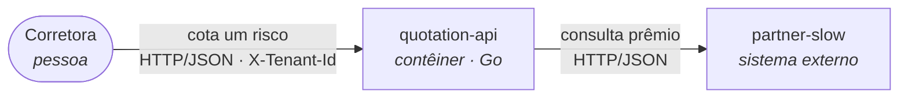

# Desafio — Fundamentos de Arquitetura de Solução

> Rascunho do enunciado. Este documento vira o `README.md` do starter na publicação.

## 1. O negócio

Antes de olhar qualquer diagrama: de que empresa estamos falando e como ela ganha dinheiro. Toda
decisão que você vai defender no SAD se apoia aqui.

### A empresa, o produto e os inquilinos

A **Prumo Tecnologia em Seguros** é uma empresa fictícia. Ela não vende seguro: vende software
para quem vende. O produto é o **Prumo Cota**, plataforma de cotação de **seguro auto** contratada
por corretoras. Um corretor informa motorista e veículo, o Prumo Cota consulta **três seguradoras
parceiras** e devolve as propostas lado a lado, da mais barata para a mais cara. A Prumo não emite
apólice, não assume risco e não precifica: ela intermedeia.

A plataforma é **multi-tenant** — cada requisição declara a corretora no cabeçalho `X-Tenant-Id`
(duas cadastradas no starter, algumas centenas em produção). E isso não é detalhe de
implementação: cada corretora tem condições comerciais próprias com cada seguradora, então a mesma
placa, para o mesmo motorista, volta com prêmios diferentes conforme quem pergunta. Uma resposta
entregue à corretora errada é erro de preço **e** vazamento de dado de terceiro.

O Prumo Cota é uma fachada sobre sistemas que a Prumo não controla — motores de precificação
legados, com janelas de manutenção próprias e SLAs que as próprias seguradoras descumprem. Se a
dependência externa cai, não há produto. **A instabilidade das parceiras é o coração do negócio,
não um problema plantado para o exercício.**

### Cada consulta custa dinheiro

O contrato com cada seguradora cobra **por consulta ao motor de precificação**, não por venda
fechada:

| | |
|---|---|
| Custo por consulta a uma seguradora | R$ 0,04 |
| Consultas por cotação | 3 (uma por parceira) |
| Cotações por dia útil | 120.000 |
| Preço cobrado da corretora, por cotação entregue | R$ 0,25 |
| Dias úteis no mês | 22 |

São 360.000 consultas por dia útil: **R$ 14.400 por dia**, ~**R$ 317.000 por mês** em chamadas a
parceiro, contra R$ 660.000 de receita. Quase metade da receita bruta sai pela porta da dependência
externa — e boa parte dessas consultas é repetida, porque o corretor recota a mesma placa várias
vezes na mesma conversa e o cliente pede a mesma cotação em mais de uma corretora.

As seguradoras honram o prêmio informado por **até 24 horas**, e o contrato com a corretora exige
que a cotação exibida ainda seja praticável na hora da venda. Existe, portanto, um teto legítimo
para reaproveitar uma cotação — e reaproveitar por mais tempo é mais barato e mais arriscado ao
mesmo tempo. **Onde parar é decisão de negócio, e é sua.**

### O que a regulação impõe

**SUSEP.** A Prumo processa o registro das operações de corretoras reguladas. Toda cotação
apresentada a um consumidor precisa ser **auditável** — qual seguradora, qual prêmio, para qual
corretora, em que instante — retida por cinco anos e não regravável. Isso tem custo de
armazenamento, pesa na escolha de onde os dados vivem e obriga que resposta servida de cache ou de
fallback continue rastreável até a consulta que a originou.

**LGPD.** Uma cotação carrega CPF, ano de nascimento e placa: dados pessoais. A corretora é
**controladora**, a Prumo é **operadora**, e o contrato entre elas proíbe uso cruzado de dados,
exigindo minimização e prazo de descarte. Isolamento entre inquilinos deixa de ser cuidado de
engenharia e vira obrigação legal: uma chave de cache que devolva a uma corretora o que outra
cotou não é bug — é incidente de dados pessoais, com dever de notificação à ANPD.

### Por que isso importa para a sua entrega

1. **O cache é decisão financeira.** Cada acerto é uma consulta que não foi comprada; o efeito do
   hit rate entra com número na planilha de TCO da seção 8 do seu SAD.
2. **On-premise vs. cloud se decide com compliance, não com preferência.** SUSEP e LGPD são os
   argumentos que a seção 5 do seu SAD tem que enfrentar: retenção, residência e segregação.
3. **Disponibilidade é promessa comercial.** Hoje a disponibilidade do Prumo Cota é o *produto* da
   disponibilidade das três parceiras. Quem vende para corretora não pode entregar isso.

## 2. Entrega 1 — o SAD

A primeira entrega é um documento: o **Solution Architecture Document** do Prumo Cota depois da sua
intervenção. Ele descreve o sistema que você vai construir na entrega 2 e, mais que descrever,
**justifica**. A ordem importa: o PoC é subordinado ao SAD, não o contrário. Você implementa a
fatia que o seu próprio documento defendeu.

Escreva para três leitores que existem de verdade e que não leem template:

- o **CTO da Prumo**, que aprova (ou não) o gasto e quer ver a conta;
- quem vai **operar** a plataforma às 3h da manhã, e precisa saber o que fazer quando uma parceira
  afundar;
- o **encarregado de dados / auditoria**, que precisa provar à ANPD e à SUSEP que a cotação servida
  de cache continua rastreável e que uma corretora nunca vê o dado de outra.

Se uma frase do seu SAD não serve a nenhum dos três, ela é enchimento.

### Três regras que valem para o documento inteiro

**Regra 1 — rastreabilidade. Citar arquivo que não existe reprova.** Toda afirmação sobre o sistema
aponta para algo verificável: um caminho real do repositório (`internal/partner/client.go`), um
trecho deste enunciado, ou uma medição que você fez e colou. A correção é estática — quem corrige
**abre os caminhos citados**. Um `internal/resilience/breaker.go` que só existe no documento é
reprovação imediata, não desconto de nota, e o mesmo vale para biblioteca inventada, métrica que
ninguém emite e endpoint que o código não serve. Escrever sobre o que ainda não existe é permitido
e esperado — desde que esteja marcado como o que é: proposta. O que reprova é apresentar ficção
como fato.

**Regra 2 — números, não adjetivos.** "Escalável", "robusto", "alta disponibilidade", "baixa
latência" e "performático" não são requisitos: são opiniões. Um requisito não funcional precisa de
**métrica, valor, unidade e método de medição** — "p95 do `POST /quotes` abaixo de 800 ms, medido
no histograma `http_server_request_duration_seconds` do Prometheus". Sem os quatro, não conta como
requisito. O mesmo vale para dinheiro: a seção 8 é uma planilha, não um parágrafo dizendo que o
cache "reduz custos".

**Regra 3 — diagrama é código, em C4 com Mermaid.** Todo diagrama vai em bloco Mermaid — três
crases seguidas de `mermaid` — dentro do próprio Markdown. Imagem colada não vale: o que precisa
ser verificado é o texto, porque ele dá `diff`, aparece na revisão e não desatualiza em silêncio.
Níveis obrigatórios: **1 (contexto)** e **2 (contêiner)** na seção 2 do seu SAD, **3 (componente)**
na seção 4, e só da fatia que você implementa. Nível 4 (código) não é pedido.

O Mermaid tem `C4Context`/`C4Container` nativos, ainda experimentais; um `flowchart` também serve,
desde que a semântica do C4 esteja preservada — pessoa, sistema, contêiner e sistema externo
distinguíveis, e **toda relação rotulada com o que trafega e por qual tecnologia**. Seta sem rótulo
não é diagrama de arquitetura.

### As oito seções

#### 1. Introdução — propósito, escopo, restrições, pressupostos

Diga para quem o documento serve e qual decisão ele sustenta. Delimite o escopo pelos dois lados: o
SAD cobre a plataforma de cotação e a sua **fronteira** com as seguradoras — não redesenha o motor
de precificação delas nem o CRM da corretora. E separe com clareza o que é **restrição** (imposta:
Go, ambiente local sem custo, três parceiras, cobrança por consulta, retenção SUSEP de cinco anos,
papel de operadora na LGPD) do que é **decisão** (sua: TTL, limiares do breaker, onde a plataforma
roda). Confundir os dois é o erro que faz o documento inteiro perder autoridade — ninguém defende
uma escolha que apresenta como imposição.

Pressuposto é número que você assume sem poder medir hoje. Declare cada um com o valor, a origem e
a **consequência se ele for falso**: "assumo que 30% das cotações se repetem em até uma hora (o
corretor recota a mesma placa na mesma conversa); se for 5%, o cache não se paga e a seção 8 muda
de veredito".

- **Mínimo verificável:** escopo com lista explícita do que ficou de fora; restrições separadas das
  decisões; cada pressuposto com valor, origem e o que muda no documento se ele cair.
- **Não conta:** pressuposto sem consequência declarada — é enfeite, não pressuposto.

#### 2. Visão geral da arquitetura

Uma página que mostre o **antes** e o **depois**, com os diagramas C4 de nível 1 e 2. O "antes" não
é imaginação: os contêineres estão no `docker-compose.yml` e os nomes têm que bater
(`quotation-api`, `partner-slow`, `partner-flaky`, `partner-degrading`, `redis`, `otel-collector`,
`jaeger`, `prometheus`). O nível 1 mostra os atores externos — a corretora e as três seguradoras —
e deixa visível o que a seção 1 deste enunciado afirma: a Prumo intermedeia, não precifica.

Feche com o **delta** em lista: o que você acrescenta, o que muda de lugar e o que sai. Um
parágrafo curto de "a quem esta arquitetura serve" ancora tudo o que vem depois.

- **Mínimo verificável:** C4 nível 1 e nível 2 em Mermaid; o diagrama do "antes" bate com os
  serviços do `docker-compose.yml`; lista explícita das mudanças entre antes e depois.
- **Reprova:** contêiner no diagrama que não existe nem no compose nem na sua entrega — é o caso
  mais comum de violação da regra 1.

#### 3. Requisitos funcionais e não funcionais

Os funcionais saem do contrato que já existe, não da sua cabeça: `POST /quotes` exige `X-Tenant-Id`
e rejeita quem não mandar; a resposta agrega as três parceiras ordenadas da mais barata para a mais
cara (`internal/quotation/service.go`); toda cotação apresentada tem que ficar auditável por cinco
anos; e uma resposta servida de cache ou de fallback continua rastreável até a consulta que a
originou. Escreva cada um como frase testável, com identificador (RF-01…), e acrescente os que a
**sua** arquitetura cria.

Os não funcionais vão em tabela, e o "hoje" é medido, não estimado — ele está no
`docs/roteiro-cenario-de-falha.md` e você reproduz com `make reproduce`:

| ID | Requisito | Métrica | Hoje | Alvo | Como medir | Por que este número |
|---|---|---|---|---|---|---|
| RNF-01 | Latência da cotação | p95 do `POST /quotes` | 8,01 s sob carga | *sua decisão* | `http_server_request_duration_seconds` | *sua justificativa* |

A coluna que separa o arquiteto do preenchedor de template é a última. Um alvo de p95 tem que vir
de algum lugar — do tempo que o corretor aguenta esperar com o cliente na frente dele, do SLA que a
Prumo vende, ou da soma das parceiras no melhor caso. "Porque é um bom número" não é origem.

- **Mínimo verificável:** funcionais com identificador e frase testável; não funcionais com
  métrica, valor, unidade, método e origem do alvo; a coluna "hoje" coerente com o que o roteiro
  mede.
- **Não conta:** qualquer não funcional sem número ou sem método de medição.

#### 4. Detalhamento da arquitetura

O coração do documento. Aqui entram as decisões, cada uma no formato **contexto → opções
consideradas → escolha → consequências, inclusive as ruins**. No mínimo: circuit breaker, cache e
fallback — e, se você mexer neles, timeout e a serialidade da agregação, que hoje soma as três
parceiras em vez de sobrepô-las.

Todo parâmetro numérico é uma decisão e precisa da sua defesa: por que o breaker abre com N falhas
em uma janela de M segundos e não com outro par; quantas requisições o estado meio aberto deixa
passar; qual o TTL do cache diante da janela de **24 horas** em que a seguradora honra o prêmio — e
por que parar antes dela, se você parar. Escreva a **chave do cache literalmente**: se `tenant_id`
não estiver nela, você acabou de projetar um incidente de dados pessoais, não uma otimização. E
diga o que o fallback devolve, como o cliente sabe que aquilo é fallback, e como a resposta
continua auditável para a SUSEP.

O C4 de nível 3 mora aqui, cobrindo a fatia protegida — a fronteira com a parceira vive em
`internal/partner/client.go` e a agregação em `internal/quotation/service.go`.

- **Mínimo verificável:** os três mecanismos com opções descartadas e consequências; todo parâmetro
  numérico justificado; a chave de cache escrita por extenso; C4 nível 3 da fatia implementada.
- **Não conta:** "usaremos circuit breaker" sem os três estados, sem limiar e sem janela. É
  exatamente a frase que este desafio existe para tornar impossível.

#### 5. Implementação

Duas perguntas: **como se constrói** e **onde roda**.

Como: o mapa de cada mecanismo para o arquivo do repositório onde ele nasce, com caminhos reais;
qual biblioteca e por que ela (a de circuit breaker que expõe os três estados explicitamente vale
mais que a mais estrelada); e como o comportamento é **testado sem depender de sorte** — o starter
já mostra o padrão em `cmd/partner-mock/feasibility_test.go`, que prova de forma determinística que
os defaults das parceiras permitem um breaker abrir.

Onde: é aqui que se decide **on-premise, cloud ou híbrido**, e a decisão se defende com o
compliance do domínio, não com preferência. SUSEP impõe retenção de cinco anos, registro não
regravável e uma conversa sobre residência do dado; a LGPD põe a Prumo como operadora, com
segregação entre controladoras e prazo de descarte. Some o custo, que reaparece na seção 8. "Cloud
é o padrão de mercado" não é argumento — é ausência de argumento.

- **Mínimo verificável:** mapa mecanismo → arquivo real do repositório; decisão de hospedagem com
  pelo menos uma alternativa descartada e o motivo regulatório e financeiro; estratégia de teste do
  comportamento resiliente.

#### 6. Operação e gestão de mudanças

O SAD é lido em produção, sob pressão. A observabilidade que você instrumentar na entrega 2 é o
instrumento desta seção: diga **o que se olha** (estado do breaker, hit rate do cache, latência por
parceira), **qual limiar dispara alerta** e **qual ação o alerta exige**. Alerta sem limiar e sem
ação não é alerta, é ruído.

Escreva pelo menos um **runbook** completo de um cenário real — "o breaker da `partner-degrading`
está aberto há dez minutos" — com o que o plantonista faz, o que ele **não** faz, e quando escala.
E trate a gestão de mudanças pelo caso que importa neste domínio: o TTL do cache é parâmetro de
**negócio**, porque mexe em risco de preço vencido e em custo. Quem aprova mudá-lo, como ela chega
em produção, como se reverte e como se mede se melhorou.

- **Mínimo verificável:** cada alerta com métrica, limiar e ação; um runbook do começo ao fim; o
  caminho completo de mudança de um parâmetro de negócio, com reversão.
- **Não conta:** "monitoraremos com Prometheus e Grafana". Isso é uma lista de compras.

#### 7. Recuperação de desastres

RTO e RPO com número — e **por classe de dado**, porque elas não valem o mesmo. Perder o cache
custa dinheiro e latência; perder o registro de auditoria da SUSEP é infração regulatória. Um RPO
único para os dois é sinal de que a seção não foi pensada.

Cubra no mínimo três cenários: (a) o Redis inteiro se perde; (b) uma parceira fica fora por seis
horas; (c) perda do site ou da região onde a plataforma roda. Para cada um: o que a corretora vê, o
que **degrada** e o que **para** (não é a mesma coisa), quanto custa em reais o modo degradado, e o
caminho de volta. O cenário (a) tem endereço na seção 8: cache vazio é 100% das consultas compradas
de novo.

- **Mínimo verificável:** RTO e RPO numéricos por classe de dado; três cenários com efeito no
  cliente, custo e procedimento de retorno; distinção explícita entre degradar e parar.

#### 8. Tecnologias, custos e pessoal (TCO)

A seção que fecha o circuito — a linha de código da entrega 2 tem que aparecer aqui como dinheiro.
Os números de partida estão na seção 1 deste enunciado: R$ 0,04 por consulta, três consultas por
cotação, 120.000 cotações por dia útil, 22 dias úteis, R$ 0,25 de receita por cotação entregue.

Entregue quatro coisas:

1. **A conta de parceiro por cenário.** Uma linha para hoje (hit rate zero) e uma para cada hit
   rate que o **seu** TTL sustenta, com as colunas: hit rate assumido · consultas compradas por mês
   · custo mensal · economia contra hoje · percentual da receita. Sem valores prontos aqui: a conta
   é sua.
2. **O custo da infraestrutura que você acrescenta.** Redis, retenção de traces e métricas, e o
   armazenamento de auditoria — este último **cresce todo mês** e precisa de cinco anos de
   retenção, então mostre pelo menos o ano 1 e o ano 5, não só o primeiro mês.
3. **Pessoal.** Quantas pessoas, quais papéis, para construir e depois para operar, com custo
   mensal. Arquitetura que ninguém tem gente para manter é arquitetura que não existe.
4. **O veredito.** O cache se paga? Em quanto tempo? Se a resposta for "não", diga — um SAD que
   conclui contra a solução preferida, com a conta na mão, vale mais que um que conclui a favor sem
   ela.

**É aqui que o documento inteiro é testado por coerência.** O hit rate desta seção tem que ser
compatível com o TTL da seção 4 e com o pressuposto de recotação da seção 1. TTL de quinze minutos
sustentando 70% de acerto exige explicação; se ela não estiver em lugar nenhum, o número é chute —
e um chute na planilha contamina a decisão que ele sustenta.

- **Mínimo verificável:** planilha de custo de parceiro por cenário; custo de infraestrutura com a
  curva da retenção de cinco anos; custo de pessoal; veredito explícito de payback; coerência
  numérica com as seções 1 e 4.
- **Não conta:** preço de instância copiado de calculadora sem dizer quantas instâncias e por quê.

### O que este SAD não é

Não é um template preenchido, e a diferença é verificável de fora: **cada seção referencia outra**.
O requisito da seção 3 aparece como mecanismo na 4, como arquivo na 5, como alerta na 6, como
cenário de desastre na 7 e como reais na 8. Um documento em que as oito seções poderiam ser lidas
em qualquer ordem, sem que nada quebrasse, é oito documentos curtos — não um SAD.

Também não é um documento longo por obrigação. Quantos requisitos, quantos diagramas e quantas
páginas estão reunidos no bloco **Critérios quantitativos**, no fim deste enunciado, e é lá que
você confere se entregou o suficiente.
