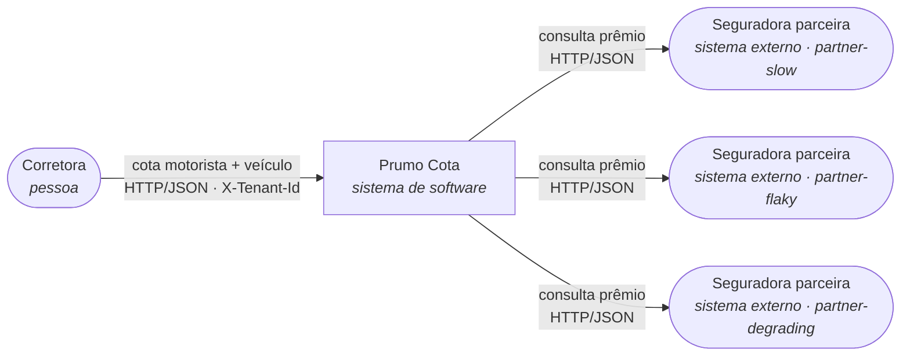

# SAD: Prumo Cota (plataforma de cotação de seguro auto)

## 1. Introdução

## 2. Visão geral da arquitetura

### Nível 1: Contexto (vale para o antes e o depois: a fronteira com o mundo não muda)

A Prumo intermedeia três seguradoras e devolve a lista ordenada por prêmio; ela não precifica risco
nem emite apólice (os motores de precificação são das seguradoras, fora da fronteira deste SAD).

### Nível 2: Contêiner, ANTES

Uma falha em qualquer parceira aborta a requisição inteira (`internal/quotation/service.go`), e o
tempo de resposta é a soma das três chamadas sequenciais, sem teto (`internal/partner/client.go`, sem
`Timeout`).

### Nível 2: Contêiner, DEPOIS

### O delta

- **Acrescenta:** uso efetivo do `redis` (já subia ocioso no compose) como cache de cotação por
  parceira; timeout de 2000ms e circuit breaker por parceira (`sony/gobreaker`, 5 falhas consecutivas)
  na chamada de `internal/partner/client.go`; fallback de resposta parcial com complemento de cotação
  anterior de cache quando uma parceira falha ou está com o circuito aberto; três métricas de negócio
  e duas marcações de trace novas, exportadas ao mesmo `otel-collector` que já está de pé.
- **Muda de lugar:** nada muda de contêiner (os mesmos oito serviços do `docker-compose.yml`
  continuam existindo com o mesmo papel). Toda a diferença fica dentro do processo `quotation-api`
  (o cliente HTTP decorado) e no `redis`, que passa de ocioso a consumido.
- **Sai:** nada sai. O contrato de sucesso de `POST /quotes` é estendido (não substituído) para
  carregar a marcação de degradação que o fallback introduz (ver seção 4).

**A quem esta arquitetura serve:** para a corretora, o delta é a diferença entre um 502 quando
qualquer parceira tropeça e uma cotação parcial ou levemente desatualizada, mas utilizável, na maioria
das vezes em que isso acontece; para quem opera a plataforma às 3h da manhã, é ter um estado de
circuito e um hit rate para olhar antes de um cliente ligar reclamando; para o encarregado de dados, é
a garantia de que a cotação servida de cache ou de fallback continua isolada por corretora e
rastreável até a consulta que a originou.

## 3. Requisitos funcionais e não funcionais

## 4. Detalhamento da arquitetura

## 5. Implementação

## 6. Operação e gestão de mudanças

## 7. Recuperação de desastres

## 8. Tecnologias, custos e pessoal (TCO)

