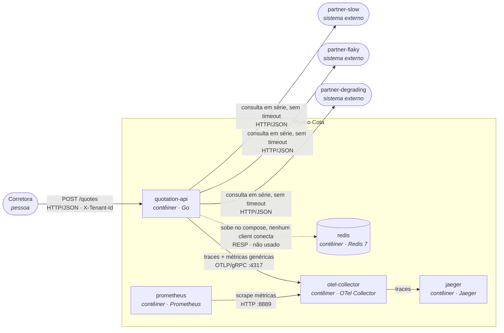
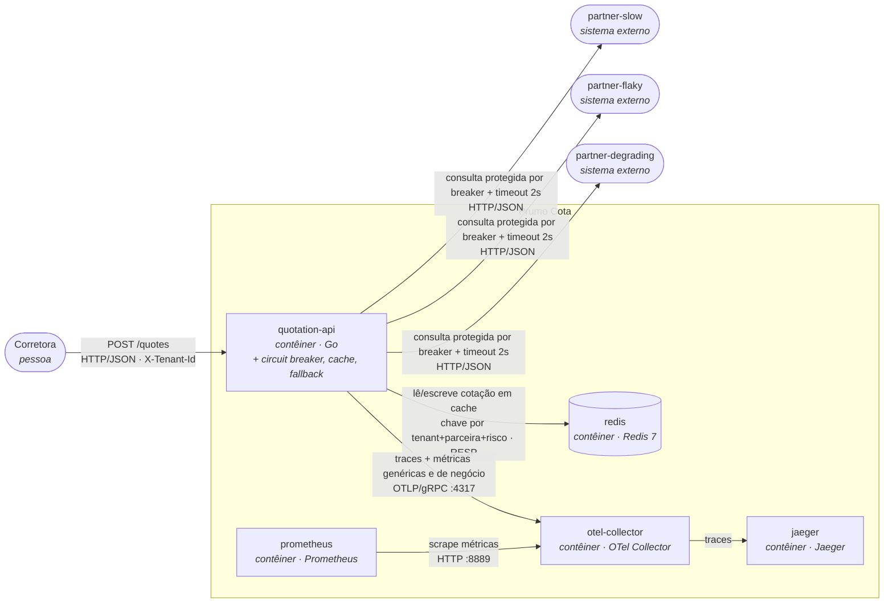

# SAD: Prumo Cota (plataforma de cotação de seguro auto)

## 1. Introdução

## 2. Visão geral da arquitetura

### Nível 1: Contexto (vale para o antes e o depois: a fronteira com o mundo não muda)

A Prumo intermedeia três seguradoras e devolve a lista ordenada por prêmio; ela não precifica risco
nem emite apólice (os motores de precificação são das seguradoras, fora da fronteira deste SAD).

### Nível 2: Contêiner, ANTES

Uma falha em qualquer parceira aborta a requisição inteira (`internal/quotation/service.go`), e o
tempo de resposta é a soma das três chamadas sequenciais, sem teto (`internal/partner/client.go`, sem
`Timeout`).

### Nível 2: Contêiner, DEPOIS

### O delta

- **Acrescenta:** uso efetivo do `redis` (já subia ocioso no compose) como cache de cotação por
  parceira; timeout de 2000ms e circuit breaker por parceira (`sony/gobreaker`, 5 falhas consecutivas)
  na chamada de `internal/partner/client.go`; fallback de resposta parcial com complemento de cotação
  anterior de cache quando uma parceira falha ou está com o circuito aberto; três métricas de negócio
  e duas marcações de trace novas, exportadas ao mesmo `otel-collector` que já está de pé.
- **Muda de lugar:** nada muda de contêiner (os mesmos oito serviços do `docker-compose.yml`
  continuam existindo com o mesmo papel). Toda a diferença fica dentro do processo `quotation-api`
  (o cliente HTTP decorado) e no `redis`, que passa de ocioso a consumido.
- **Sai:** nada sai. O contrato de sucesso de `POST /quotes` é estendido (não substituído) para
  carregar a marcação de degradação que o fallback introduz (ver seção 4).

**A quem esta arquitetura serve:** para a corretora, o delta é a diferença entre um 502 quando
qualquer parceira tropeça e uma cotação parcial ou levemente desatualizada, mas utilizável, na maioria
das vezes em que isso acontece; para quem opera a plataforma às 3h da manhã, é ter um estado de
circuito e um hit rate para olhar antes de um cliente ligar reclamando; para o encarregado de dados, é
a garantia de que a cotação servida de cache ou de fallback continua isolada por corretora e
rastreável até a consulta que a originou.

## 3. Requisitos funcionais e não funcionais

### Requisitos funcionais

Do contrato que já existe hoje (`internal/quotation/handler.go`, `internal/quotation/service.go`):

- **RF-01.** `POST /quotes` exige o cabeçalho `X-Tenant-Id`; sem ele, a resposta é `400` com
  `{"error":"X-Tenant-Id is required"}`.
- **RF-02.** Uma corretora fora da lista configurada em `TENANTS` recebe `403` com
  `{"error":"broker not enabled on this platform"}`.
- **RF-03.** A resposta de sucesso agrega as cotações das três parceiras, ordenadas por
  `premium_cents` crescente.
- **RF-04.** Toda cotação apresentada ao consumidor, inclusive a servida de cache ou de fallback,
  permanece rastreável até a consulta que a originou, atendendo à exigência de auditoria de cinco
  anos da SUSEP.

Criados por esta arquitetura:

- **RF-05.** Quando uma parceira falha ou está com o circuito aberto, a resposta entrega as cotações
  das parceiras que responderam, sinalizando explicitamente qual parceira está ausente, em vez de
  abortar a requisição inteira.
- **RF-06.** Quando existe, em cache e dentro do TTL vigente, uma cotação da parceira ausente, ela é
  incluída na resposta marcada como proveniente de cache, com a idade dela; se não existir, a resposta
  segue só com as parceiras que responderam.
- **RF-07.** A chave de cache identifica univocamente a corretora (`tenant_id`); nenhuma corretora
  recebe, em nenhuma circunstância, uma cotação em cache originada por outra corretora.

### Requisitos não funcionais

| ID     | Requisito                                  | Métrica                                                                       | Hoje                                                                                                                                             | Alvo                                                                            | Como medir                                                                   | Por que este número                                                                                                                                                                                                                                                                            |
|--------|--------------------------------------------|-------------------------------------------------------------------------------|--------------------------------------------------------------------------------------------------------------------------------------------------|---------------------------------------------------------------------------------|------------------------------------------------------------------------------|------------------------------------------------------------------------------------------------------------------------------------------------------------------------------------------------------------------------------------------------------------------------------------------------|
| RNF-01 | Latência da cotação                        | p95 do `POST /quotes`                                                         | 8,00 s sob carga (baseline 2,03 s), medido em 2026-08-30 (`docs/evidencias/historico-reproduce.md`)                                              | ≤ 4 s sob a mesma carga                                                         | `http_server_request_duration_seconds`                                       | Agregação continua em série (paralelizar é opcional e fora desta entrega); com timeout de 2000 ms por parceira, o pior caso plausível é `partner-slow` (≈1,7 s) mais `partner-flaky` (≈0,2 s) mais `partner-degrading` no teto do timeout (2 s), aproximadamente 3,9 s, com margem até 4 s     |
| RNF-02 | Disponibilidade percebida pela corretora   | proporção de respostas não-502 sobre o total                                  | 60% sob carga (baseline 50%), medido em 2026-08-30                                                                                               | ≥ 98%                                                                           | `http_server_request_duration_seconds_count` por `http.response.status_code` | `partner-slow` e `partner-degrading` nunca falham; só `partner-flaky` falha (40%). Com o fallback (RF-05/RF-06) entregando resposta parcial sempre que ao menos uma parceira responde, só há falha total se as três estiverem indisponíveis ao mesmo tempo, cenário raro nos perfis do compose |
| RNF-03 | Tempo de detecção de uma parceira instável | número de falhas consecutivas até a transição fechado para aberto do circuito | não aplicável (não existe circuito hoje; cada falha chega inteira até a corretora)                                                               | circuito abre em até 5 falhas consecutivas por parceira                         | contador de transições de estado do breaker (nome definido na seção 4)       | a rajada real de 9 falhas consecutivas da `partner-flaky` (sequências 49 a 57, seed determinística) mostra que um limiar de 5 é atingido dentro da mesma rajada, sem depender de uma parceira artificialmente ruim                                                                             |
| RNF-04 | Economia de consultas compradas via cache  | hit rate do cache (hit sobre hit mais miss)                                   | 0% (Redis sobe no compose, mas nenhum client conecta; `internal/quotation/service.go` não o usa)                                                 | curva de hit rate visivelmente crescente sob a carga padrão do `make reproduce` | consulta PromQL sobre o contador de hit/miss (nome definido na seção 4)      | o objetivo aqui é provar que o mecanismo funciona; o hit rate de produção que sustenta a economia financeira é tratado à parte na seção 8, porque a carga padrão repete cinco cotações e não representa tráfego real                                                                           |
| RNF-05 | Ausência de dado pessoal em telemetria     | contagem de spans e métricas de negócio com atributo CPF, placa ou `quote_id` | 0 (a telemetria genérica atual, HTTP de entrada e saída, runtime do Go, não carrega esses campos; conferido em `internal/platform/telemetry.go`) | 0, sempre                                                                       | inspeção dos atributos declarados no código antes de cada release            | requisito regulatório da LGPD, não meta de engenharia negociável                                                                                                                                                                                                                               |

## 4. Detalhamento da arquitetura

## 5. Implementação

## 6. Operação e gestão de mudanças

## 7. Recuperação de desastres

## 8. Tecnologias, custos e pessoal (TCO)

